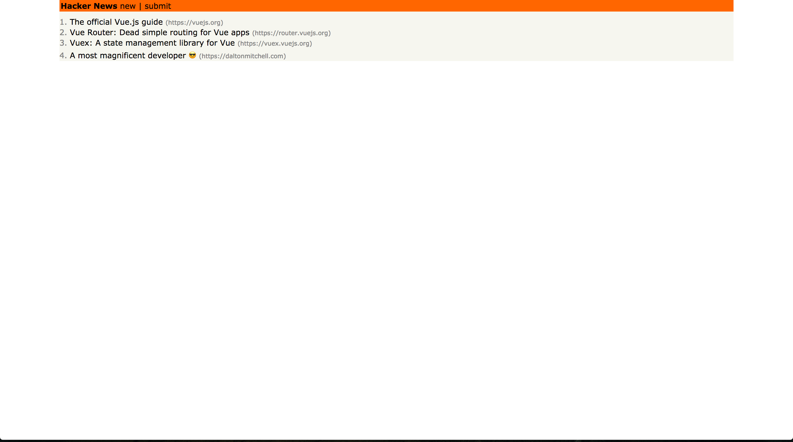
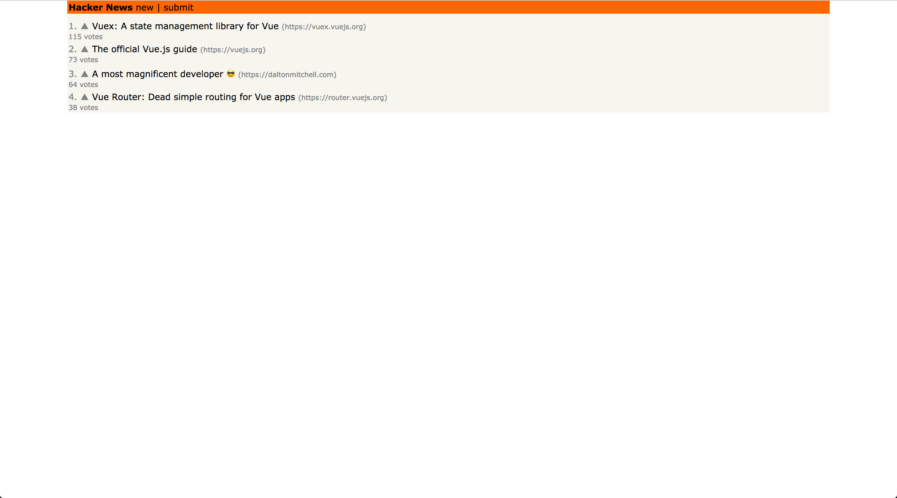

# Getting Hooked on Vue.js

# <br>
# <br>
# <br>

### Dalton Mitchell
### Software Engineer @ Riskalyze
### @daltonamitchell / daltonmitchell.com

---

# Getting Hooked on Vue.js

# <br>
# <br>
# <br>

### Dalton Mitchell
### Software Engineer @ Riskalyze
### @daltonamitchell / daltonmitchell.com
### We're hiring! - Riskalyze.com/careers

---

# A little about Vue.js

^ - What is Vue?
- A web framework.
- Vue is designed from the ground up to be incrementally adoptable. The core library is focused on the view layer only, and is very easy to pick up and integrate with other libraries or existing projects.

---

# My experience...

^ Talk about my experience
- Skeptical
- Talk about project constraints

---

# What makes Vue so awesome?

- Flexible
- Lightweight
- Performant
- Incrementally adoptable

^ - Flexible: Use with or without build tools, with any app structure you like
- Lightweight: 19kb GZipped
- Performant
- Incrementally adoptable

---

# What this talk is about

### My first experience with Vue.js and why I continue to be a fan

---

# What this talk is NOT about

### Teaching you everything you need to know about Vue.js

#### VueJS.org is a great place to learn all the things! 🤓

---

# Let's build an app!

- Vue Instance
- Vue Component
- Single File Components

---

# The Vue Instance

^ The Vue instance is the root of all Vue apps. It provide a declarative way for us to render some data to the DOM using a template

---

# The Vue Instance

```html
<div id="app">
  {{ message }}
</div>
```

```javascript
var app = new Vue({
  el: '#app',
  data: {
    message: 'Vue is awesome!'
  }
})
```

^ Here's what a basic Vue instance looks like. But a Vue instance can have more than just data.

---

# The Vue Instance

### Template Element

```html
<div id="app"><!-- Vue can control stuff here --></div>
```

```javascript
new Vue({
  el: '#app' // Specify a root element to bind to in our template
})
```

---

# The Vue Instance

### Reactive Data

```javascript
new Vue({
  el: '#app',
  // This data will be available in our template
  data: {
    foo: 'bar',
    baz: 2
  }
})
```

^ Data contains static properties that will be available to our template.

---

# The Vue Instance

### Computed Properties

```javascript
new Vue({
  el: '#app',
  data: {
    firstName: 'Dalton',
    lastName: 'Mitchell'
  },
  computed: {
    // re-evaluate if firstName or lastName changes
    fullName() {
      return `${this.firstName} ${this.lastName}` // 'Dalton Mitchell'
    }
  }
})
```

^ - computed prop are similar to data, except they change dynamically based on other values.
- computed properties are cached based on their dependencies. So they only re-evaluate when one of their dependencies change

---

# The Vue Instance

### Methods

```html
<div id="app">
  <button v-on:click="sayHello(fullName)">Say Hello</button>
</div>
```

```javascript
new Vue({
  el: '#app',
  data: {...},
  computed: {
    fullName() {...}
  },
  methods: {
    sayHello(name) {
      alert(`Hello ${name}!`)
    }
  }
})
```

^ - Methods allow us to define functions that can be executed from our template.
- Within a method, we have access to data variables, but it's usually preferred to pass in data directly

---

# The Vue Instance

### Watchers

```html
<div id="app">
  <h1>Who are you?</h1>
  <input v-model="name">
</div>
```

```javascript
new Vue({
  el: '#app',
  data: {
    name: ''
  },
  computed: {...},
  watch: {
    // Run this function when name changes
    name(newName) {
      console.log(`Hi ${newName}, it's a pleasure to meet you!`)
    }
  }
})
```

^ - Explain what v-model does
- Watchers allow us to specify some behavior that happens when our data changes. They differ from computed properties in that they don't need to return a value
- You probably want a watcher if you explicitly need a side effect

---

# Building a Hacker News Clone

---

```html
<!DOCTYPE html>
<html>
  <head>
    <title>Hacker News</title>
    <link rel="stylesheet" href="/css/style.css">
  </head>
  <body>
    <div id="app">
      <ul>
        <li v-for="post in posts">{{ post.description }} ({{ post.url }})</li>
      </ul>
    </div>

    <script src="https://unpkg.com/vue/dist/vue.js"></script>
    <script>
      const posts = [...]

      const app = new Vue({
        el: '#app',
        data: {
          posts: posts
        }
      })
    </script>
  </body>
</html>
```

---

```html
<!DOCTYPE html>
<html>
  <head></head>
  <body>
    ...
    <script src="https://unpkg.com/vue/dist/vue.js"></script>
    <script>
      const posts = [
        {
          "description": "The official Vue.js guide",
          "url": "https://vuejs.org"
        },
        {
          "description": "Vue Router: Dead simple routing for Vue apps",
          "url": "https://router.vuejs.org"
        },
        {
          "description": "Vuex: A state management library for Vue",
          "url": "https://vuex.vuejs.org"
        },
        {
          "description": "A most magnificent developer 😎",
          "url": "https://daltonmitchell.com"
        }
      ]
    </script>
  </body>
</html>
```

---

```html
<!DOCTYPE html>
<html>
  <head></head>
  <body>
    ...
    <script src="https://unpkg.com/vue/dist/vue.js"></script>
    <script>
      const posts = [...]

      const app = new Vue({
        el: '#app',
        data: {
          posts: posts // An array of posts to display
        }
      })
    </script>
  </body>
</html>
```

---

```html
<!DOCTYPE html>
<html>
  <head></head>
  <body>
    <div id="app">
      <ul>
        <li v-for="post in posts">{{ post.description }} ({{ post.url }})</li>
      </ul>
    </div>

    <script src="https://unpkg.com/vue/dist/vue.js"></script>
    <script>...</script>
  </body>
</html>
```

---

```html
<!DOCTYPE html>
<html>
  <head></head>
  <body>
    <div id="app">
      <nav>
        <ul>
          <li class="logo">Hacker News</li>
          <li>new |</li>
          <li>submit</li>
        </ul>
      </nav>
      <main>
        <ul class="posts">
          <li v-for="(post, index) in posts" class="post">
            <span class="text-gray">{{ index + 1 }}.</span>
            {{ post.description }}
            <span class="text-small text-gray">({{ post.url }})</span>
          </li>
        </ul>
      </main>
    </div>

    <script src="https://unpkg.com/vue/dist/vue.js"></script>
    <script></script>
  </body>
</html>
```

---



---

```javascript
const posts = [{
    "description": "The official Vue.js guide",
    "url": "https://vuejs.org",
    "votes": 73
  },
  {
    "description": "Vue Router: Dead simple routing for Vue apps",
    "url": "https://router.vuejs.org",
    "votes": 38
  },
  {
    "description": "Vuex: A state management library for Vue",
    "url": "https://vuex.vuejs.org",
    "votes": 115
  },
  {
    "description": "A most magnificent developer 😎",
    "url": "https://daltonmitchell.com",
    "votes": 64
  }]
```

^ Let's add our the ability to upvote posts.
- We'll start by adding a "votes" field to our data

---

```html
<ul class="posts">
  <li v-for="(post, index) in posts" class="post">
    <span class="text-gray">{{ index + 1 }}.</span>
    <span class="upvote text-gray">▲</span>
    {{ post.description }}
    <span class="text-small text-gray">({{ post.url }})</span>
    <div class="text-small text-gray">{{ post.votes }} votes</div>
  </li>
</ul>
```

^ And then display the votes

---

```javascript
const app = new Vue({
  el: '#app',
  data: {
    posts: posts
  },
  computed: {
    sortedPosts() {
      return this.posts.sort((a, b) => a.votes - b.votes)
    }
  }
})
```

^ - Now we can easily sort by number of votes
- We should use a computed property to observe changes as votes change

---

```html
<ul class="posts">
  <li v-for="(post, index) in sortedPosts" class="post">
    <span class="text-gray">{{ index + 1 }}.</span>
    <span class="upvote text-gray">▲</span>
    {{ post.description }}
    <span class="text-small text-gray">({{ post.url }})</span>
    <div class="text-small text-gray">{{ post.votes }} votes</div>
  </li>
</ul>
```

---



---

```javascript
const posts = [{
    "id": 0,
    "description": "The official Vue.js guide",
    "url": "https://vuejs.org",
    "votes": 73
  },
  {
    "id": 1,
    "description": "Vue Router: Dead simple routing for Vue apps",
    "url": "https://router.vuejs.org",
    "votes": 38
  },
  {
    "id": 2,
    "description": "Vuex: A state management library for Vue",
    "url": "https://vuex.vuejs.org",
    "votes": 115
  },
  {
    "id": 3,
    "description": "A most magnificent developer 😎",
    "url": "https://daltonmitchell.com",
    "votes": 64
  }]
```

^ - We need to know which button was click so we can record the correct vote
 - We should probably have an id field to help us with that

---

```html
<ul class="posts">
  <li v-for="(post, index) in sortedPosts" v-bind:key="post.id" class="post">
    <span class="text-gray">{{ index + 1 }}.</span>
    <span class="upvote text-gray" v-on:click="upvote(post.id)">▲</span>
    {{ post.description }}
    <span class="text-small text-gray">({{ post.url }})</span>
    <div class="text-small text-gray">{{ post.votes }} votes</div>
  </li>
</ul>
```

^ - Now we can pass that id into an `upvote` method
- Explain what `:key` does

---

```html
<ul class="posts">
  <li v-for="(post, index) in sortedPosts" :key="post.id" class="post">
    <span class="text-gray">{{ index + 1 }}.</span>
    <span class="upvote text-gray" @click="upvote(post.id)">▲</span>
    {{ post.description }}
    <span class="text-small text-gray">({{ post.url }})</span>
    <div class="text-small text-gray">{{ post.votes }} votes</div>
  </li>
</ul>
```

^ Explain alternative `v-bind` syntax

---

```javascript
const app = new Vue({
  el: '#app',
  data: {
    posts: posts
  },
  methods: {
    upvote(id) {
      let post = this.posts.find((p) => p.id === id)
      post.votes++
    }
  },
  computed: {
    sortedPosts() {
      return this.posts.sort((a, b) => b.votes - a.votes)
    }
  }
})
```

^ Build the `upvote` method

---


---

# Vue Components

^ Vue components allow us to encapsulate a piece of our application, along with it's state, in a way that's also easy to reuse

---

# Vue Components

```html
<div id="my-element"></div>
```

```javascript
new Vue({
  el: '#my-element',
  // options
})
```

---

# Vue Components

```html
<my-component></my-component>
```

```javascript
Vue.component('my-component', {
  // options
})
```

---

# Vue Components

```html
<div id="example">
  <my-component></my-component>
</div>
```

```javascript
Vue.component('my-component', {
  // options
})

new Vue({
  el: '#example',
})
```

^ Remember to register your component BEFORE you root instance

---

# Vue Components

### Template

```html
<div id="example">
  <my-component></my-component>
</div>
```

```javascript
Vue.component('my-component', {
  template: '<div>A custom component!</div>'
})

new Vue({
  el: '#example',
})
```

^ Template takes a string representation of your components DOM

---

# Vue Components

### Template

```html
<div id="example">
  <div>A custom component!</div>
</div>
```

^ Template takes a string representation of your components DOM

---

# Vue Components

### Data must be a function

```javascript
Vue.component('my-component', {
  template: '<span>{{ message }}</span>',
  data: {
    message: 'hello'
  }
})
```

^ - Components can take most of the same properties as a normal instance
- One exception is the data property
- In a component, data must be a function that returns the data object

---

# Vue Components

### Props

```html
<!-- kebab-case in HTML -->
<child my-message="hello!"></child>
```

```javascript
Vue.component('child', {
  // camelCase in JavaScript
  props: ['myMessage'],
  template: '<span>{{ myMessage }}</span>'
})
```

^ - Components can take props from their parent
- You must explicitly declare the props your component expects

---

# Vue Components

### Props

```html
<child my-message="hello!"></child>
```

```javascript
Vue.component('child', {
  props: {
    myMessage: String,
  },
  template: '<span>{{ myMessage }}</span>'
})
```

^ We can add some validation to props this way

---

# Vue Components

### Props

```html
<child my-message="hello!"></child>
```

```javascript
Vue.component('child', {
  props: {
    myMessage: {
      type: String,
      required: false,
      default: 'Hello World'
    }
  },
  template: '<span>{{ myMessage }}</span>'
})
```

^ We can add some validation to props this way

---

# Refactoring our app with components

---

```html
<div id="app">
  <Navbar></Navbar>
  ...
</div>
```

```html
<script type="text/x-template" id="navbar-template">
  <nav v-once>
    <ul>
      <li class="logo">Hacker News</li>
      <li>new |</li>
      <li>submit</li>
    </ul>
  </nav>
</script>
```

```javascript
const posts = [...]

Vue.component('navbar', {
  template: '#navbar-template'
})

const app = new Vue({
  el: '#app',
  ...
})
```

^ Build the Nav component

---

```html
<div id="app">
  <Navbar></Navbar>
  <main>
    <post-list :posts="posts"></post-list>
  </main>
</div>
```

```html
<script type="text/x-template" id="postlist-template">
  <ul class="posts">
    <li v-for="(post, index) in sortedPosts" :key="post.id" class="post">
      <span class="text-gray">{{ index + 1 }}.</span>
      <span class="upvote text-gray" @click="upvote(post.id)">▲</span>
      {{ post.description }}
      <span class="text-small text-gray">({{ post.url }})</span>
      <div class="text-small text-gray">{{ post.votes }} votes</div>
    </li>
  </ul>
</script>
```

```javascript
Vue.component('post-list', {
  template: '#postlist-template',
  props: {
    posts: Array
  },
  computed: {
    sortedPosts() {
      return this.posts.sort((a, b) => b.votes - a.votes)
    }
  }
})
```

^ Build the PostList component

---

```html
<script type="text/x-template" id="postlist-template">
  <ul class="posts">
    <post
      v-for="(post, index) in sortedPosts"
      :post="post"
      :order="index + 1"
      :key="post.id"
    ></post>
  </ul>
</script>

<script type="text/x-template" id="post-template">
  <li class="post">
    <span class="text-gray">{{ order }}.</span>
    <span class="upvote text-gray" @click="upvote(post.id)">▲</span>
    {{ post.description }}
    <span class="text-small text-gray">({{ post.url }})</span>
    <div class="text-small text-gray">{{ post.votes }} votes</div>
  </li>
</script>
```

```javascript
Vue.component('post', {
  template: '#post-template',
  props: {
    post: Object,
    order: Number
  },
  methods: {
    upvote(id) {
      let post = this.posts.find((p) => p.id === id)
      post.votes++
    }
  }
})
```

^ Build the Post component

---

# We don't have access to posts anymore. How do we fix this? 🤔

```javascript
upvote(id) {
  // this.posts === undefined
  let post = this.posts.find((p) => p.id === id)
  post.votes++
}
```

---

# We don't have access to posts anymore. How do we fix this? 🤔
# We should use an event!

```javascript
upvote(id) {
  // this.posts === undefined
  let post = this.posts.find((p) => p.id === id)
  post.votes++
}
```

---

# First, the parent needs to listen for the event

```html
<script type="text/x-template" id="postlist-template">
  <ul class="posts">
    <post
      v-for="(post, index) in sortedPosts"
      :post="post"
      :order="index + 1"
      :key="post.id"
      @upvote="handleUpvote"
    ></post>
  </ul>
</script>
```

```javascript
Vue.component('post-list', {
  ...
  methods: {
    handleUpvote(id) {
      let post = this.posts.find((p) => p.id === id)
      post.votes++
    }
  }
})
```

^ Explain how the parent listens for and handles the event

---

# Next, the child needs to fire the event

```javascript
Vue.component('post', {
  template: '#post-template',
  props: {
    post: Object,
    order: Number
  },
  methods: {
    // Tell anyone who cares that an 'upvote' happened and pass along an id
    // Let them decide what to do with that info
    upvote(id) {
      this.$emit('upvote', id)
    }
  }
})
```

^ Explain how the child sends the event

---

# Single File Components

Using the Webpack ```vue-loader``` we can create components which have their template (HTML), JS & CSS in one file

---

# Single File Components

### Benefits

- Keep all our "concerns" in one file
- Speed up development
- Works with build tools such as Babel and preprocessors

^ - We can now write HTML & CSS locally scoped to our component which is really helpful for moving quickly and designing our app features as we build them
- We can have all the power of Babel, SASS, Pug or anything else that makes us more productive
- We can spend time thinking about our app.
- "What components do I need?" vs "where should I put this?"

---

# Single File Components

```html
<!-- App.vue -->

<template>
  <div id="app">
    <h1>{{ msg }}</h1>
  </div>
</template>

<script>
export default {
  name: 'app',
  data() {
    return {
      msg: 'Welcome to Your Vue.js App'
    }
  }
}
</script>

<style lang="scss" scoped>
#app {
  font-family: 'Avenir', Helvetica, Arial, sans-serif;
  -webkit-font-smoothing: antialiased;
  -moz-osx-font-smoothing: grayscale;
  text-align: center;
  color: #2c3e50;
  margin-top: 60px;
}
</style>
```

---

# A little more refactoring...

---

# Install Vue CLI

```bash
yarn global add vue-cli
vue init webpack-simple hn-clone
```

---

# Start the development server

```bash
yarn
yarn dev
```

---

# Demo

---

# What have I learned

---

# What have I learned

1. We should care about the beginner experience
2. Documentation matters
3. You can have power without adding bloat

---

# What I'd like to see more of

1. Better onboarding
2. Better docs
3. Smaller, focused libs that play well with others

---

# Thank you!

# <br>
# <br>
# <br>

## Dalton Mitchell
### @daltonamitchell / daltonmitchell.com
